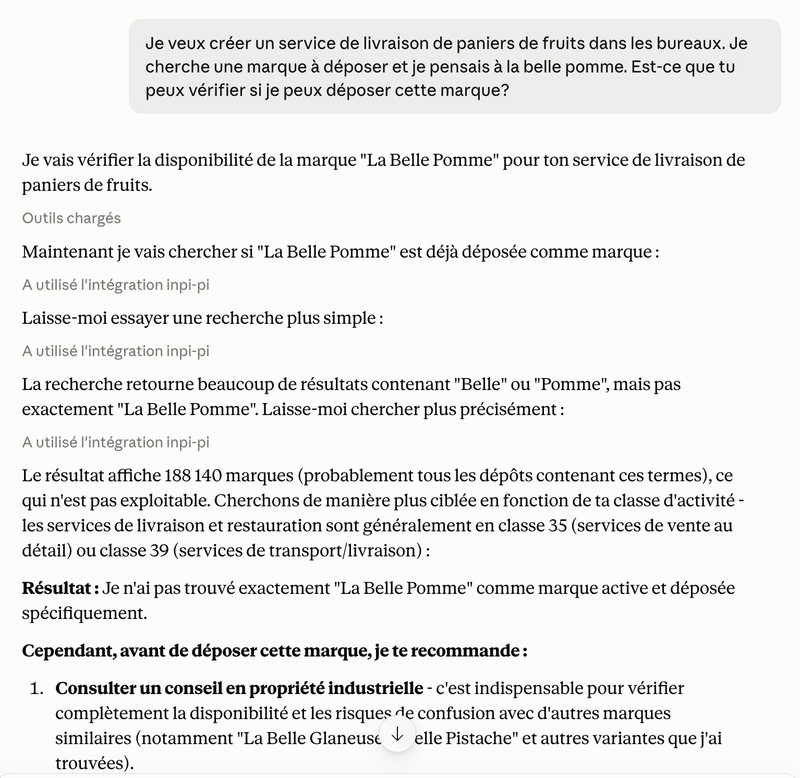

# mcp-inpi-pi

[](https://github.com/bsab/france-mcp-servers)

Serveur [MCP](https://modelcontextprotocol.io/) exposant l'[API Propriété industrielle de l'INPI](https://www.inpi.fr/ressources/propriete-intellectuelle/acces-aux-api-et-ftp).

> **Ce projet est indépendant et n'est ni affilié, ni approuvé, ni sponsorisé par l'INPI.**

## Démo

[](https://youtu.be/oTb_nEoo00U)

## Fonctionnalités

| Tool / Resource | Description |
|---|---|
| `search_trademarks` | Recherche de marques par nom, classe, titulaire |
| `get_trademark_details` | Fiche complète d'une marque (classes, statut, titulaire, événements) |
| `nice-classes://list` | Classification de Nice — 45 classes avec titres et exemples (données embarquées) |

## Installation

### Obtenir un compte API INPI (gratuit)

1. Créez un compte sur [data.inpi.fr](https://data.inpi.fr)
2. Allez dans "Mon espace client" → "Accès APIs PI"
3. Sélectionnez le contenu "Marques"
4. Un email d'activation vous sera envoyé pour créer votre mot de passe API

### Configuration Claude Desktop

```json
{
  "mcpServers": {
    "inpi-pi": {
      "command": "npx",
      "args": ["-y", "@guix77/mcp-inpi-pi"],
      "env": {
        "INPI_USERNAME": "votre-email@exemple.fr",
        "INPI_PASSWORD": "votre-mot-de-passe-API"
      }
    }
  }
}
```

## Transport HTTP (expérimental)

Un transport HTTP alternatif est disponible via la commande `mcp-inpi-pi-http`. Il utilise le protocole [Streamable HTTP](https://modelcontextprotocol.io/specification/2025-03-26/basic/transports#streamable-http) du SDK MCP (remplaçant le SSE classique, désormais déprécié).

```bash
PORT=3000 INPI_USERNAME=… INPI_PASSWORD=… npx @guix77/mcp-inpi-pi-http
```

Endpoints exposés :
- `POST /mcp` — endpoint MCP principal (gestion de sessions via header `mcp-session-id`)
- `GET /health` — health check (`{"status":"ok","transport":"streamable-http"}`)

> Ce transport est expérimental : il n'est pas encore intégré dans les configurations Claude Desktop standard.

### Docker (expérimental)

```bash
# Exporter les variables puis lancer
INPI_USERNAME=… INPI_PASSWORD=… docker compose up -d
```

Ou sans docker-compose :

```bash
docker build -t mcp-inpi-pi .
docker run -p 3000:3000 \
  -e INPI_USERNAME=… \
  -e INPI_PASSWORD=… \
  mcp-inpi-pi
```

> Le conteneur expose uniquement le transport HTTP. Pour une intégration stdio classique (Claude Desktop), aucun conteneur n'est nécessaire.

## Variables d'environnement

| Variable | Requis | Description |
|---|---|---|
| `INPI_USERNAME` | Oui | Email du compte API INPI |
| `INPI_PASSWORD` | Oui | Mot de passe du compte API INPI |
| `INPI_MAX_REQUESTS_PER_MINUTE` | Non | Limite de requêtes/min (défaut : 30) |
| `INPI_MAX_REQUESTS_PER_HOUR` | Non | Limite de requêtes/h (défaut : 500) |
| `PORT` | Non | Port HTTP pour le transport expérimental (défaut : 3000) |

## Exemples d'utilisation

> Vérifie si le nom "FreshMeal" est déjà déposé comme marque en classe 43.

> Donne-moi les détails de la marque FR4216963.

## Couverture et extensions

La couverture de l'API Propriété industrielle par ce serveur MCP est **actuellement limitée** : elle ne couvre ni les brevets, ni les dessins et modèles, et ne couvre les marques que partiellement.

Vous souhaitez étendre cette couverture ou intégrer d'autres sources de données PI dans vos workflows ? Je peux réaliser cette extension sous forme de **prestation sur mesure**, et je propose également la **conception de workflows Claude (Skills) adaptés à votre métier**.

Contactez-moi : [guillaume.duveau@gmail.com](mailto:guillaume.duveau@gmail.com)

## Avertissement

Les résultats fournis par cet outil sont **indicatifs** et ne constituent pas un avis juridique. Consultez un conseil en propriété industrielle pour toute décision relative au dépôt ou à l'utilisation d'une marque.

## Licence

MIT

---

# mcp-inpi-pi (English)

[MCP](https://modelcontextprotocol.io/) server for searching French, European and international trademarks via the [INPI](https://data.inpi.fr) API (French National Institute of Industrial Property).

> **This project is independent and is not affiliated with, endorsed by, or sponsored by INPI.**

See French documentation above for setup instructions. The INPI API requires a free account on [data.inpi.fr](https://data.inpi.fr).

Coverage of the Industrial Property API is **currently limited**: patents and designs are not covered, and trademark coverage is partial. Need to extend coverage or integrate other IP data sources into your workflows? I offer **custom development** and **Claude workflow design (Skills) tailored to your business**.

Contact: [guillaume.duveau@gmail.com](mailto:guillaume.duveau@gmail.com)
